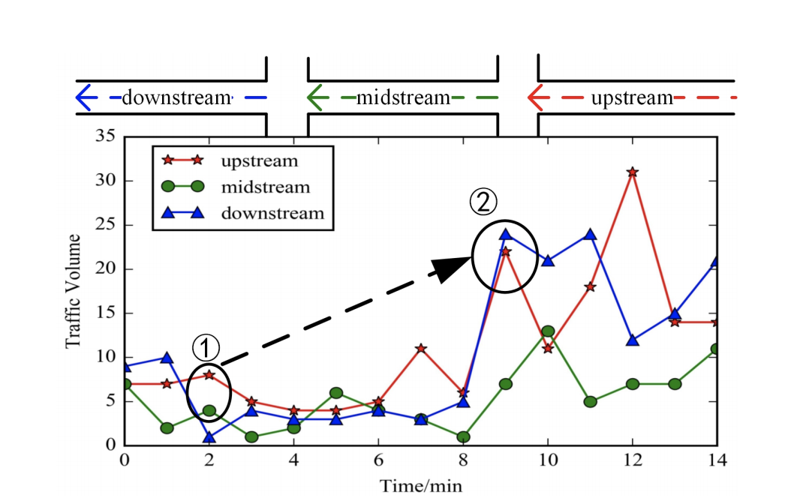

# Introduction

The repo for temporal and spatial speed models, targets two scenarios:
- Speed imputation: increase the coverage of speed derived from GPS observations.
- Speed forecasting: predict future speed in the next 15 minute or 1 hour.

## The implemented models:
- Graph Convolutional Networks + LSTMs/CNNs
- (unfinished) Tensor Factorization

## Requirements
* [PyTorch](http://pytorch.org/) version >= 1.2.0
* Python version >= 3.6
* For training new models, you'll also need an NVIDIA GPU

## Getting Started

* `preprocess.py` does feature extraction
* `trainer.py` train TGCN model

 
The spatial and temporal speed dependency with the topological structure of the road network.